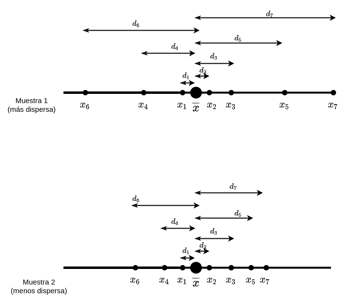
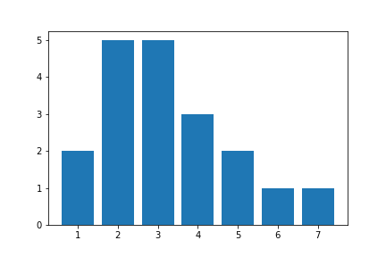
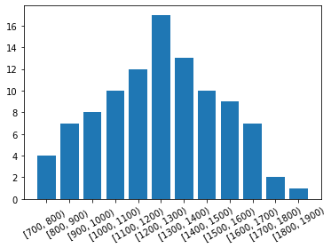

# Definiciones Básicas

- Una **población** es un conjunto de todos los elementos que estamos estudiando, acerca de los cuales intentamos sacar conclusiones. Debemos definir esa población de modo que quede claro cuándo
cierto elemento pertenece o no a la población. 

- Una **muestra** es una colección de algunos elementos de la población, no de todos. 

- Una **muestra representativa** contiene las características relevantes de la población en las mismas
proporciones en que están incluidas en tal población. 

### Ejemplo

En las elecciones generales, la **población** sería el conjunto total de votantes. Una muestra sería seleccionar a 1000 individuos para intentar predecir el resultado de las elecciones. La muestra será **representativa** si contiene la misma proporción de mujeres y hombres que la población votante, geográficamente todas las regiones están proporcionalmente representadas...

## Variables estadísticas

La noción de variable estadística, es una simplificación del concepto de *variable aleatoria* que veremos en temas posteriores. De momento, definiremos *variable estadística* como:

> característica o cualidad de un individuo que está propensa a adquirir diferentes 
> valores. Estos valores, a su vez, se caracterizan por poder medirse. 

### Tipos de variables estadísticas

- **Cuantitativas**: Pueden ser medidas numéricamente.
    - **Continuas**: Puede tomar cualquier valor dentro de un intervalo o intervalos
    - **Discretas**: Solo toma una cantidad discreta de valores (por ejemplo una cantidad finita de valores)
- **Cualitativas**: son aquellas características o cualidades que no pueden ser calculadas con números, sino que son clasificadas con palabras

### Ejemplo
- Cualitativa: Situación laboral de una persona (empleado / estudiante / paro). 
- Cuantitativa continua: IPC, IBEX
- Cuantitativa discreta: número de hermanos, edad.

# Las tablas de frecuencias

Pensemos en los siguientes datos: Supongamos que hemos extraído una muestra de la producción diaria de 30 telares de alfombras

$$16.2, 15.7, 16.4, 15.4, 16.4, 15.8, 16.0, 15.2, 15.7, 16.6, 15.8,$$
$$ 16.2, 15.9, 15.9, 15.6, 15.8, 16.1, 15.9, 16.0, 15.6, 16.3, 16.8,$$
$$ 15.9, 16.3, 16.9, 15.6, 16.0, 16.8, 16.0, 16.3$$

Observamos que los datos presentan repeticiones y que por lo tanto podemos hablar de *frecuencias* de ciertos valores de datos como por ejemplo 15.6 aparece tres veces.

lo primero que vamos a hacer es **ordenar los datos** y lo segundo **apuntar cuantas veces aparece cada dato**

|valor|nº de veces que aparece|
|-|-|
|15.2| 1|
|15.4| 1|
|15.6| 3|
|15.7| 2|
|15.8| 3|
|15.9| 4|
|16.0| 4|
|16.1| 1|
|16.2| 2|
|16.3| 3|
|16.4| 2|
|16.6| 1|
|16.8| 2|
|16.9| 1|

Esto que acabamos de hacer es una **tabla de frecuencias** y es la manera más directa de estudiar los datos, especialmente cuando hay repeticiones.

Por último, la tabla anterior tiene quizás demasiadas columnas, una idea sería *resumir* la información agrupando los datos por intervalos. Por ejemplo podemos tomar intervalos de longitud $0.5$ e ir anotando cuantos valores encontramos que pertenezcan a ese intervalo.

|intervalo |nº datos en el intervalo|
|-|-|
|[15, 15.25)| 1|
|[15.25, 15.5)| 1|
|[15.5, 15.75)| 5|
|[15.75, 16)| 7|
|[16, 16.25)| 7|
|[16.25, 16.5)| 5|
|[16.5, 16.75)| 1|
|[16.75, 17) | 3|

### Definición
Una **tabla de frecuencias** (también conocida como tabla de relaciones de frecuencias) es una tabla en la que se organizan los datos en clases, es decir, en grupos de valores que escriben una característica de los datos y muestra el número de observaciones del conjunto de datos que caen en cada una de las clases.

### Notación

Si estamos ante una tabla de frecuencias

- A cada observación (habitualmente de la muestra ordenada) de la muestra la llamaremos $x_i$
- Al *nº de veces que aparece el dato* $x_i$ lo llamaremos **frecuencia absoluta** y lo denotaremos por $n_i$
- Al número total de datos lo llamaremos $N$
- A la suma de la frecuencia $n_i$ más todas las anteriores le llamamos **frecuencia absoluta acumulada** y la denotamos por $N_i$.
  
Si si la tabla está agrupada por intervalos

- A cada intervalo llamaremos $I_i = [l_i, l_{i+1})$
- al valor medio del intervalo lo llamaremos **marca de clase** $x_i = \frac{l_i+ l_{i+1}}{2}$
- las frecuencias absuluta y absoluta acumulada se calculan igual pero en vez de contar el número de veces que aparece el dato contamos el *número de datos encontrados en el intervalo*.

Juntemos todo esto en el ejemplo anterior tenemos para la tabla sin agrupar

|$x_i$|$n_i$|$N_i$|
|-|-|-|
|15.2| 1|1|
|15.4| 1|2|
|15.6| 3|5|
|15.7| 2|7|
|15.8| 3|10|
|15.9| 4|14|
|16.0| 4|18|
|16.1| 1|19|
|16.2| 2|21|
|16.3| 3|24|
|16.4| 2|26|
|16.6| 1|27|
|16.8| 2|29|
|16.9| 1|30|

Y para la tabla agrupada por intervalos tenemos

|intervalo |$x_i$| $n_i$| $N_i$|
|-|-|-|-|
|[15, 15.25)|15.125| 1| 1|
|[15.25, 15.5)|15.375| 1| 2|
|[15.5, 15.75)|15.625| 5| 7|
|[15.75, 16)|15.875| 7| 14|
|[16, 16.25)|16.125| 7| 21|
|[16.25, 16.5)|16.375| 5| 26|
|[16.5, 16.75)|16.625| 1| 27|
|[16.75, 17) |16.875| 3| 30|

# Medidas de concentración

Las medidas de concentración proporcionan información de los *valores centrales* en torno a los cuales se distribuyen los datos.

Son cálculos que realizaremos usando distintas estrategias sobre las tablas de frecuencias que hemos visto

## Media

En general la media artimética de un conjunto de números
$$x_1, x_2, x_3,\ldots , x_n$$

se obtiene sumando todos valores y dividiendo por el número de sumando es decir
$$\frac{x_1 + x_2 + x_3 +\ldots  + x_n}{n} = \frac{1}{n}\sum^{n}_{i=1} x_i$$

a este valor se le denota $\overline x$

### Idea geométrica
Dados dos puntos en el espacio $x$ e $y$, el punto medio entre ambos es justamente $(x+y)/2$. Esto ocurre tanto en la recta como en el espacio

{ width=250px}

### Cómo calcularla

Para calcularlo, si tenemos una tabla de frecuencias 

|$x_i$|$n_i$|
|-|-|
|$x_1$| $n_1$|
|$x_2$| $n_2$|
|$x_3$| $n_3$|
|$\vdots$|$\vdots$|
|$x_N$|$n_N$|

puesto que cada valor $x_i$ se repite $n_i$ veces, calcularemos la media de la siguiente manera

$$\overline x = \frac{x_1 \cdot n_1 + x_2  \cdot n_2 + x_3  \cdot n_3 +\ldots  + x_N  \cdot n_N}{N} = \frac{1}{N}\sum^{N}_{i=1} x_i  \cdot n_i$$

en el caso de que tengamos una tabla de frecuencias agrupadas por intervalos

|$I_i$|$x_i = \frac{x_i + x_{i+1}}{2}$|$n_i$|
|-|-|-|
|$[l_1, l_2)$| $x_1$|$n_1$|
|$[l_2, l_3)$| $x_2$| $n_2$|
|$[l_3, l_4)$| $x_3$|$n_3$|
|$\vdots$|$\vdots$|$\vdots$|
|$[l_{K}, l_{K+1})$| $x_K$|$n_K$|

haremos lo mismo pero usando la marca de clase $x_i = \frac{l_i + l_{i+1}}{2}$

### Ejemplos

La siguiente tabla recoge las ventas de 100 sucursales de una empresa

|ventas (miles)|$x_i$| $n_i$| $x_i \cdot n_i$
|-             |-    |   -| -|
|[700, 800)    |750  |   4|  3000   |        
|[800, 900)    |850  |   7|  5950   |    
|[900, 1000)   |950  |   8|  7600   |     
|[1000, 1100)  |1050 |  10|  10500  |      
|[1100, 1200)  |1150 |  12|  13800  |      
|[1200, 1300)  |1250 |  17|  21250  |      
[1300, 1400)   |1350 |  13|  17550  |   
[1400, 1500)   |1450 |  10|  14500  |   
[1500, 1600)   |1550 |   9|  13950  |   
[1600, 1700)   |1650 |   7|  11550  |   
[1700, 1800)   |1750 |   2|  3500   |   
[1800, 1900)   |1850 |   1|  1850   |   

calculemos la media

\begin{align*}
\overline x &= \frac{1}{N}\sum^{N}_{i=1} x_i  \cdot n_i\\
&= \frac{750  \cdot  4 + 850  \cdot  7 + 950 \cdot 8 +  \ldots + 1850 \cdot  1}{100}\\
& = \frac{3000  + 5950  + 7600  + 10500 + 13800 + 21250 + 17550 + 14500 + 13950 + 11550 + 3500  + 1850}{100}\\
&=\frac{125000}{100}=1250
\end{align*}

### Propiedades de la media
- Se ve muy afectada por valores extremos
- La media de dos variables es la suma de dos medias

  \begin{align*}
   x_1, x_2, x_3,\ldots , x_n &\longrightarrow \overline x\\
   y_1, y_2, y_3,\ldots , y_n &\longrightarrow \overline y
   &\\
   x_1 + y_1, x_2+y_2, \ldots , x_n + y_n & \longrightarrow \overline{x+y}
  \end{align*}

  $$\overline{x + y} = \overline x + \overline y$$

- Sumar a cada valor de los datos una cierta cantidad y hacer la media del resultado es lo mismo que sumar dicha cantidad a la media de los datos:
  
\begin{align*}
\overline{x+k} &= \frac{(x_1 +k)+ (x_2+k) +\ldots  + (x_N +k) }{N}\\
&=\frac{N\cdot k + x_1+  x_2 +  x_3  +\ldots  +  x_N}{N} = \overline {x} +k
\end{align*}

- Multiplicar a una variable por una cantidad y hacer su media resulta en multiplicar a la media por dicha cantidad:
  
\begin{align*}
k \overline{x} &= k\frac{x_1+ x_2  + x_3  +\ldots  + x_N }{N}\\
&=\frac{k x_1+ k x_2 + k x_3  +\ldots  + k x_N}{N} = \overline {kx}
\end{align*}

## Moda

La **moda** ($Mo$) es el valor que aparece con mayor frecuencia en un conjunto de datos. Si hubiera varios datos con frecuencia máxima (no hay un único dato con mayor frecuencia sino varios) la moda serían todos ellos. Por lo tanto la moda puede no ser única.

### Cómo calcularla

Simplemente buscamos el valor o valores con mayor frecuencia absoluta.

### Ejemplo

La siguente muestra es el resultado realizar una muestra de renta per capita en un barrio concreto de madrid (en miles de euros anuales brutos)

$$ 14, 23, 15, 17,12, 0.5, 30, 12, 23, 18, 25, 30, 15, 12, 23 $$

|$x_i$|$n_i$| 
|-    |-    |   
| 0.5 |1  |     
|  12 |3  |      
|  14 |1 |       
|  17 |1 |       
|  18 |1 |       
|  23 |3 |    
|  30 |2 |    

Luego la moda es:
$$Mo = 12, 23$$

<!-- 
Para obtener la moda en datos agrupados por intervalos, debemos primero buscar el intervalo de mayor frecuencia $I_i$ y para elegir que valor es la moda dentro de ese intervalo se usa la siguiente fórmula: \ref{a}

   $$M=L_{i}+\left({\frac {D_{1}}{D_{1}+D_{2}}}\right)A_{i}$$

Donde:

$\displaystyle L_{i}$ = Límite inferior de la clase modal.

$D_1 =$ es la diferencia entre la frecuencia absoluta modal y la frecuencia absoluta premodal.

$D_2 =$ es la diferencia entre la frecuencia absoluta modal y la frecuencia absoluta postmodal.

$A_{i} =$ Amplitud del intervalo modal

!-->

## Mediana

La mediana $Me$ representa el valor de la variable de posición central en un conjunto de datos ordenados.

Si tenemos un número impar de datos, tomamos como mediana simplemente el valor que ocupe la posición central al ordenarlos, por ejemplo para los datos

$$1, 2, 3, 4, 5$$
 
El dato central es $3$ así que $Me = 3$.

Si tenemos un número par de datos,  al ordenar los datos no encontraremos un dato central, sino dos, con lo cual tomaremos como mediana la media entre estos dos datos centrales. Por ejemplo para los datos

$$7, 8, 9, 10, 11, 12 $$

No hay un dato central, podríamos decir que los valores $9$ y $10$ son *centrales* así que tomamos $Me= (9+10)/2$

### Cómo calcularla

Si los datos no están en una tabla de frecuencias, haremos lo que hemos comentado en los párrafos anteriores. Si hemos organizado los datos por frecuencias, haremos lo siguiente:

Dada una tabla (en la que calculamos tambíen las frecuencias acumuladas)

|$x_i$|$n_i$| $N_i$
|-|-| -|
|$x_1$| $n_1$| $N_1$|
|$x_2$| $n_2$|$N_2$|
|$x_3$| $n_3$|$N_3$|
|$\vdots$|$\vdots$|$\vdots$|
|$x_N$|$n_N$| $N_N$|

1. Buscamos el valor que ocupa la *posición central* mirando en la tabla cual es el primer dato $x_i$ cuya frecuencia acumulada supera o iguala $N/2$.
2. Si encontramos un dato cuya frecuencia acumulada $N_i$ **iguala** $N/2$ tomamos como mediana la media de ese dato $x_i$ y el siguiente $x_{i+1}$. $Me = \frac{x_{i} + x_{i+1}}{2}$
3. Si no encontramos uno cuya $N_i$ iguale a $N/2$ sino uno que la supere directamente, tomamos ese dato como mediana. $Me = x_i$.

### Ejemplo 1

Se recogen datos de la satisfacción de 37 usuarios con un servicio. Los usuarios responden
con notas del 1 al 9.

|nota|$n_i$|$N_i$|
|-|-|-|
|1|2 |2  |
|2|2 |4  | 	
|3|4 |8  | 	
|4|5 |13 | 	
|5|8 |21 | 	
|6|9 |30 | 	
|7|3 |33 | 	
|8|4 |37 | 	
|9|2 |39 |

Calculamos $N/2$ y obtenemos $39/2 = 19.5$. Encontramos que el la primera frecuencia acumulada que supera o iguala $19.5$ es 21, no habiendo ninguna que la iguale, de modo que $Me = 5$

### Ejemplo 2

Si en el ejemplo anterior en lugar  de la tabla anterior hubieramos tenido la tabla:

|nota|$n_i$|$N_i$|
|-|-|-|
|1|2 |2  |
|2|2 |4  | 	
|3|4 |8  | 	
|4|5 |13 | 	
|5|8 |21 | 	
|6|9 |30 | 	
|7|3 |33 | 	
|8|4 |37 | 	
|9|5 |42 |

En este caso    $N/2= 21$ y al mirar entre las frecuencias acumuladas vemos que hay una que iguala 21, luego la mediana será
$$Me = (5+6)/2 = 5.5$$       

### Propiedades de la mediana
- No se ve afectada por valores extremos.
- Al igual que con la media
  $$Me(k\cdot x) = Me(x) \cdot k$$
  $$Me(k+ x) = Me(x) + k$$
  Esto se debe a que sumar todos los datos por una cantidad o multiplicarlos no varía la elección del valor central.
- la mediana de la suma de dos conjuntos de datos (variables) **no** coincide con la suma de las medianas de estos datos.

# Medidas de orden
Son medidas estadísticas que se basan en la ordenación de los datos para extraer propiedades de la distribución. 

Las principales medidas de orden son los Cuartiles y los percentiles.

## Cuartiles y percentiles

Dados unos datos:

$$x_1, x_2, x_3,\ldots , x_n$$

- Dado cualquier número $k$ entre 0 y 100, el **percentil** $k$ (denotado por $P_k$) es el valor $x_i$ de la muestra ordenada que deja tras de si al $k\%$ de los datos.
- El **primer cuartil** $Q_1$ es el dato $x_i$ de la muestra ordenada que deja tras de si a una cuarta parte de los datos. Por lo tanto $Q_1 = P_{25}$
- El **segundo cuartil** $Q_2$ es el dato $x_i$ de la muestra ordenada que deja tras de si a la mitad de los datos. Es decir el segundo cuartil es la mediana. $Q_2 = Me = P_{50}$.
- El **tercer cuartil** $Q_3$ es el dato $x_i$ de la muestra ordenada que deja tras de si a tres cuartas partes de los datos. Por lo tanto $Q_3 = P_{75}$

### Cómo calcularlos 

Dada una tabla (en la que calculamos tambíen las frecuencias acumuladas)

|$x_i$   |$n_i$   |$N_i$   |
|-       |-       | -      |
|$x_1$   | $n_1$  |$N_1$   |
|$x_2$   | $n_2$  |$N_2$   |
|$x_3$   | $n_3$  |$N_3$   |
|$\vdots$|$\vdots$|$\vdots$|
|$x_N$   |$n_N$   | $N_N$  |

1. Buscamos el valor que deja tras de si a la proporción de los datos que buscamos, si queremos calcular el percentil $k$, calculamos el $k$ por ciento de N (es decir $N\cdot k /100$). Después  mirando en la tabla cual es el primer dato $x_i$ cuya frecuencia acumulada supera o iguala ese valor.
2. Si encontramos un dato cuya frecuencia acumulada $N_i$ **iguala** el porcentaje de $N$ calculado antes, tomamos como $P_k$ la media de ese dato $x_i$ y el siguiente $x_{i+1}$. 
3. Si no encontramos uno cuya $N_i$ iguale el pordentaje anterior sino uno que la supere directamente, tomamos ese dato $P_k$.

Como se puede observar es el mismo proceso que hicimos con la mediana pero en vez de hacer $N/2$ hacemos $N/4$ para $Q_1$ o $3N/4$ para $Q_3$.

### Ejemplos

La siguiente tabla recoge los datos del número de veces que un conjunto de 20 encuestados consumen un determinado servicio a la semana

|$x_i$|$n_i$|$N_i$|
|-|-|-|
|1|2 |2  |
|2|5 |7  | 	
|3|5 |12  | 	
|4|3 |15 | 	
|5|3 |18 | 	
|6|1 |19 | 	
|7|1 |20 | 	

Calculemos los cuartiles

- Calculamos $25 \cdot N / 100 = 5$. Buscamos el primer valor cuya $N_i$ es mayor o igual que 5. Encontramos que el 2 directamente tiene una frecuencia acumulada que supera y no hay ningún valor que lo iguala. Así que $Q_1 = 2$.

- Calculamos $N/2 = 5$. Buscamos el primer valor cuya $N_i$ es mayor o igual que 10. Encontramos que el 3 directamente tiene una frecuencia acumulada que supera y no hay ningún valor que lo iguala. Así que $Q_2 = Me = 3$.

- Calculamos $75 N/100 = 15$. Buscamos el primer valor cuya $N_i$ es mayor o igual que 15. Encontramos que el 4 tiene una frecuencia acumulada que iguala 15 así que $Q_3 = P_{75} = (4+5)/2$.

Calculemos el percentil 90 $P_{90}$. Para ello  calculamos $0.90*N = 18$. Buscamos el primer valor cuya $N_i$ es mayor o igual que 18.  Encontramos que el 5 tiene una frecuencia acumulada que iguala 18 así que $P_{90} = (5+6)/2$.

# Medidas de dispersión

Las medidas de dispersión tratan, a **través de diferentes cálculos**, de arrojar un valor numérico que ofrezca información sobre el grado de variabilidad de una variable. En otras palabras, las medidas de dispersión valores numéricos que indican si una variable se mueve mucho, poco, más o menos que otra.

## Rango  y rango intercuartílico
Dada una muestra 
$$ x_1, x_2, \ldots , x_N$$

El **rango** se define como 

$$R= Max - Min$$
donde $Max$ es el valor máximo de la muestra y $Min$ el valor mínimo

Por otra parte el **rango intercuartílico** de define como 

$$RI =  Q_3 - Q_1$$
 
Donde $Q_3$ es el tercer cuartil y $Q_1$ el primer cuartil.

Ambas dan una idea de cual es la distancia entre los valores más pequeños y los más grandes que toma la muestra.

## Varianza y desviación típica
Dada una muestra 
$$ x_1, x_2, \ldots , x_N$$

La **varianza** se define como 

$$S^2 = \frac{1}{n}\big( (x_1 - \overline x)^2 + (x_2 - \overline x)^2 + \ldots + (x_N - \overline x)^2 \big)= \frac{1}{n}\sum^N_{i=1} (x_i - \overline x)^2$$

La idea detrás de la varianza es promediar cuanto se separa cada valor del valor medio. 

Esto se aprecia bien en la siguiente figura

{ width=550px}

En la figura vemos marcadas las distancias de cada punto respencto a la media. La varianza no es sino las sumas de los cuadrados de esas distancias. En la muestra 1 vemos como los datos están más separados respecto a la media, de modo que esas distancias serán mayores, mientras que en la muestra 2 (debajo) vemos como están menos separados y por lo tanto esto impactará en las distancias. La muestra 1 de la figura tendrá una varianza mayor que la muestra 2.

La varianza cumple que

$$S^2 = \overline{x^2} - \overline x^2$$

donde $\overline{x^2}$ indica la media de los cuadrados de las observaciones. Esta propiedad deduce simplemente expandiendo los cuadrados $(x_i - \overline x)^2$ ya que:

$$S^2 = \frac{1}{n}\sum^N_{i=1} (x_i - \overline x)^2 = \frac{1}{n}\sum^N_{i=1} (x^2_i - 2x_i \overline x + \overline x^2)$$
$$=\frac{1}{n}\sum^N_{i=1} x_i^2 - \frac{1}{n}\sum^N_{i=1}2 x_i \overline x + \sum^N_{i=1}\overline x^2$$
$$=\frac{1}{n}\sum^N_{i=1} x_i^2 - 2 \overline x^2 + \overline x^2 = \frac{1}{n}\sum^N_{i=1} x_i^2 - \overline x^2 = \overline{x^2} - \overline x^2$$

La propiedad anterior permite en ocasiones calcular la varianza de una forma más sencilla.

la desviación típica se define como la raíz cuadrada de la varianza:

$$S = \sqrt{(S^2)} = \sqrt{\frac{1}{n}\sum^N_{i=1} (x_i - \overline x)^2}$$

### Cálculo mediante tablas de frecuencias

Si tenemos una tabla de frecuencias

|$x_i$   |$n_i$   |
|-       |-       |
|$x_1$   | $n_1$  |
|$x_2$   | $n_2$  |
|$x_3$   | $n_3$  |
|$\vdots$|$\vdots$|
|$x_N$   |$n_N$   |

puesto que cada valor de la tabla $x_i$ se repite $n_i$ veces tenemos que modificar la formula anterior de la varianza para tener en cuenta al sumar estas frecuencias. 

Con una tabla como la anterior la varianza se calcula usando

$$S^2 = \frac{1}{n}\big( (x_1 - \overline x)^2 \cdot n_1 + (x_2 - \overline x)^2 \cdot n_2 + \ldots + (x_N - \overline x)^2 \cdot n_N \big)= \frac{1}{n}\sum^N_{i=1} (x_i - \overline x)^2 \cdot n_i$$

y la desviación tipica haciendo la raíz cuadrada de la expresión anterior.

$$S = \sqrt{S^2}$$

Si deseamos usar la formula  $S^2 = \overline{x^2} - \overline x^2$ debemos tener en cuenta que al tener los datos en una tabla de frecuencias el valor $\overline{x^2}$ se calculará usando:

$$\overline{x^2} = \sum^N_{i=1} x^2_i \cdot n_i$$ 

Esto lo veremos más claramente en el ejemplo más adelante. El proceso será el mismo si tenemos una tabla agrupada por intervalos, simplemente usaremos las marcas de clase.

## Desviación media

Dada una muestra $(x_i)$ como la anterior la desviación media se define de un modo similar a la varianza, pero tomando valores absolutos en vez de cuadrados:

$$DM = \frac{1}{n}\big( |x_1 - \overline x| + |x_2 - \overline x| + \ldots + |x_N - \overline x| \big)= \frac{1}{n}\sum^N_{i=1} |x_i - \overline x|$$

Al igual que con la varianza, si tenemos los datos organizados en una tabla de frecuencias deberemos multiplicar a cada sumando por su frecuencia, es decir debemos usar

$$DM = \frac{1}{n}\sum^N_{i=1} |x_i - \overline x| \cdot n_i$$

## Ejemplos
Volviendo al ejemplo de la encuesta de satisfacción realizado a unos usuarios de un servicio, teníamos la tabla:

|$x_i$|$n_i$|$N_i$|
|-|-|-|
|1|2 |2  |
|2|5 |7  | 	
|3|5 |12  | 	
|4|3 |15 | 	
|5|3 |18 | 	
|6|1 |19 | 	
|7|1 |20 | 	

Dado que el valor máximo es 7 el el mínimo es 1 tenemos:

$$R=Max - Min = 7-1=6$$

Recordemos que habíamos calculado que los cuartiles eran $Q_1 =2$ y $Q_3 = 4.5$.

Por lo tanto tenemos

$$RI= Q_3 - Q_1 = 4.5 -2 = 2.5$$

Para calcular la varianza debo calcular la media. Ampliaremos la tabla para simplificar los cálculos

|$x_i$|$n_i$|$N_i$| $x_i \cdot n_i$| $x_i^2 \cdot n_i$
|-|-|-|-|-|    
|1|2 |2  |2  | 2   |                
|2|5 |7  |10 | 20  |               
|3|5 |12 |15 | 45  |             
|4|3 |15 |12 | 48  |             
|5|3 |18 |15 | 75  |             
|6|1 |19 |6  | 36  |            
|7|1 |20 |7  | 49  |            

 
de modo que para calcular la media me basta sumar la tercera columna entera y dividir entre 20, es decir

$$\overline x = (2+10+15+\ldots 7)/20 = 3.35$$

y para calcular la varianza voy a usar la fórmula $S^2 = \overline{x^2} - \overline x^2$

para calcular $\overline{x^2}$ basta sumar la última columna correspondiente a $x_i^2 \cdot n_i$ y dividir entre el número de datos $20$.

$$\overline x^2 = (2+20+45+\ldots 49)/20 = 275/20 = 13.75$$

De modo que 

$$S^2 =\overline{x^2} - \overline x^2 = 13.75-3.35^2 = 2.5275$$ 

Para calcular la desviación típica simplemente calculamos la raíz cuadrada

$$S= \sqrt{2.5275} \cong 1.58$$

Para calcular la desviación media, necesitamos una vez más completar la tabla para calcular las diferencias $|x_i - \overline x|\cdot n_i$

|$x_i$|$n_i$| $|x_i - \overline x|\cdot n_i$|
|-|-|-| 
|1|2 |4.7   |                
|2|5 |6.75  |               
|3|5 |1.75  |             
|4|3 |1.95  |             
|5|3 |4.95  |             
|6|1 |2.65  |            
|7|1 |3.65  |   

y la variación media será el resultado de sumar la tercera columna y dividir entre 20.

$$DM \cong 26.39/20\cong 1.31$$

# Gráficos estadísticos

Los gráficos estadísticos son gráficos que intentan de capturar de forma visual la información estadística de un conjunto de datos. Particularmente tratan de representar lo concentrados o dispersos que están los datos, los valores más comunes o más centrales de la distribución así como la simetría o asimetría de los datos.

## Histogramas y diagramas de frecuencias

Los histogramas son gráficos en el que en el eje $X$ colocamos cada valor de los datos (o intervalo si hemos agrupado por intervalos) y colocamos una barra o segmento encima de cada uno de estos valores que tiene la altura igual a la frecuencia de dicho valor o intervalo.

por ejemplo si tenemos los datos del ejemplo anterior

|$x_i$|$n_i$|
|-|-|
|1|2 |                
|2|5 |               
|3|5 |             
|4|3 |             
|5|3 |             
|6|1 |            
|7|1 | 

resulta en el siguiente histograma

{ width=350px}

Mientras que para los datos

|ventas (miles)|$x_i$| $n_i$| $x_i \cdot n_i$
|-             |-    |   -| -|
|[700, 800)    |750  |   4|  3000   |        
|[800, 900)    |850  |   7|  5950   |    
|[900, 1000)   |950  |   8|  7600   |     
|[1000, 1100)  |1050 |  10|  10500  |      
|[1100, 1200)  |1150 |  12|  13800  |      
|[1200, 1300)  |1250 |  17|  21250  |      
|[1300, 1400)  |1350 |  13|  17550  |   
|[1400, 1500)  |1450 |  10|  14500  |   
|[1500, 1600)  |1550 |   9|  13950  |   
|[1600, 1700)  |1650 |   7|  11550  |   
|[1700, 1800)  |1750 |   2|  3500   |   
|[1800, 1900)  |1850 |   1|  1850   | 

Tendremos el histograma

{ width=450px}

## Diagramas de sectores

## Diagrama de cajas y bigotes

# Bibliografía

- John A. Rice. Mathematical Statistics and Data Analysis
- F. M. Dekking, C. Kraailkamp, H. P. Lopuhaa, L. E. Meester. A Modern Introduction to Probability and Statistics. Understanding Why and How.
- [https://es.wikipedia.org/wiki/Distribuci%C3%B3n_Bernoulli](https://es.wikipedia.org/wiki/Distribuci%C3%B3n_Bernoulli)
- [https://es.wikipedia.org/wiki/Distribuci%C3%B3n_binomial](https://es.wikipedia.org/wiki/Distribuci%C3%B3n_binomial)
- [https://es.wikipedia.org/wiki/Distribuci%C3%B3n_geom%C3%A9trica](https://es.wikipedia.org/wiki/Distribuci%C3%B3n_geom%C3%A9trica)