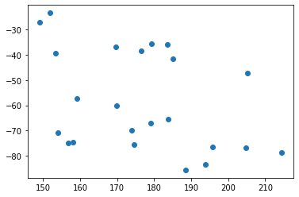
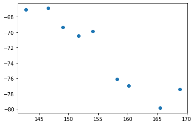
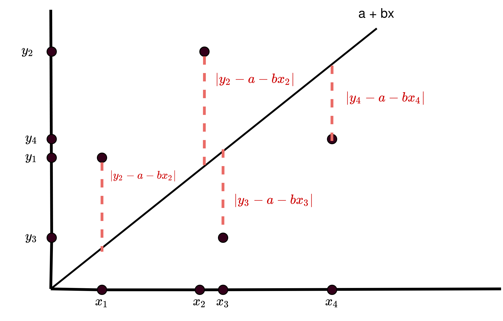

---
title: "Variables estadísticas bidimensionales"
author:
date:
geometry: margin=3cm
output: pdf_document
numbersections: true
---

En ocasiones los datos se presentan en pares $(x,y)$. Es decir que al recoger los datos no solo tenemos una variable, sino dos y hay una correspondencia entre los valores de una y los de la otra. 

Pensemos en el siguente ejemplo: 

### Ejemplo
Una empresa observa que parece haber una relación fuerte entre las ventas en enero y las ventas en febrero. Para ello se recogen los datos de 9 años y se anotan en una tabla las ventas de enero y febrero de cada año en miles de euros.

| ventas enero | ventas febrero  |
| ------ | ----- |
| 142.74 | 69.06 |
| 146.58 | 70.62 |
| 149.01 | 72.03 |
| 151.72 | 73.48 |
| 154.12 | 74.89 |
| 158.23 | 76.48 |
| 160.19 | 77.85 |
| 165.46 | 79.54 |
| 168.82 | 81.05 |

Para analizar estos datos, podríamos trabajar con cada variable por separado (calculando medias, varianzas, haciendo gráficas...), pero se perdería la relación entre ambas.  Siguendo este procedimiento sería dificil observar por ejemplo como a mayores ventas en enero corresponden mayores ventas en febrero.

Para ello trabajamos con las dos variables juntas, a través de la **Covarianza** y el **coeficiente de correlación de pearson**. Mediante ellos intentaremos capturar la relación de dependencia entre ambas variables, particularmente la *dependencia lineal,*, que ocurre cuando una de las variables puede ser aproximadas a partir de la otra mediante una recta.

# Covarianza

La **covarianza** es un valor que indica el grado de variación conjunta de dos variables aleatorias respecto a sus medias. Es el dato básico para determinar si existe una dependencia entre ambas variables y además es el dato necesario para estimar otros parámetros básicos, como el coeficiente de correlación lineal.

Supongamos que tenemos unos datos
$$(x_1, y_1), (x_2, y_2), (x_3,y_3), \ldots (x_N,y_N)$$

La covarianza se denota por $S_{xy}$ y se define como

$$ S_{xy} = \frac{1}{N}\sum^N_{i=1}(x_i - \overline{x})(y_i - \overline{y}) $$
$$ =\frac{1}{N}((x_1- \overline x)(y_1 - \overline y)+ (x_2- \overline x)(y_2 - \overline y)+ \ldots +(x_N- \overline x)(y_N - \overline y))$$

donde $\overline x$ denota la media de la primera variable ($x$), e $\overline y$ denota la media de la segunda ($y$) 

## Ejemplo
Para entender cómo calcularlo, usaremos el ejemplo anterior. Primero calculamos la media de ambas variables. En este caso como todos los datos son distintos no hay frecuencias así que para calcular las medias basta sumar y dividir entre el número de datos.

Obtenemos $\overline x \cong155.207$, $\overline y \cong77.337$. Añadimos una columna calculando las multiplicaciones $(x_i - \overline{x})(y_i - \overline{y})$

| $x_i$  | $y_i$  | $(x_i - \overline{x})(y_i - \overline{y})$ |
| ------ | ------ | ------------------------------------------ |
| 142.74 | 69.06 | 80.389                                     |
| 146.58 | 70.62 | 21.981                                     |
| 149.01 | 72.03 | 16.658                                     |
| 151.72 | 73.48 | 4.142                                      |
| 154.12 | 74.89 | -1.916                                     |
| 158.23 | 76.48 | -1.564                                     |
| 160.19 | 77.85 | 2.502                                      |
| 165.46 | 79.54 | 27.908                                     |
| 168.82 | 81.05 | 114.372                                    |

y para calcular la covarianza basta sumar esta tercera columna y dividir entre el número de datos

$$S_{xy} \cong 264.474/9 \cong 29.386$$

## El gráfico nubes de puntos

Una manera de visualizar la relación o dependencia entre las dos variables es dibujar cada punto $(x_i, y_i)$ en el plano. 

En el ejemplo anterior, el gráfico sería el siguente.

{ width=350px }

# Coeficiente de correlación de Pearson

El coeficiente de **correlación de Pearson** es una medida de dependencia lineal entre dos variables estadísticas cuantitativas. A diferencia de la covarianza, la correlación de Pearson es independiente de la escala de medida de las variables. 

Se define como

$$\rho_{XY} = \frac{S_{xy}}{S_X S_Y}$$

donde $S_{xy}$ de nota la covarianza, $S_X$ denota la desviación típica de la primera variable y $S_Y$ la desviación típica de la segunda.

en el ejemplo anterior, si calculamos además la desviación típica de $X$ e $Y$ obtenemos

$$S_x \cong 8.205$$
$$S_y \cong 3.920$$

luego 

$$\rho_{XY}\cong\frac{29.386}{8.205 \cdot 3.920} \cong 0.913$$

Deducimos de aquí que dado que el coeficiente de correlación de Pearson es cercano a 1 existe una dependencia lineal directa entre las ventas de enero y febrero

## Interpretación del coeficiente de correlación de Pearson

- Si $\rho_{XY}>{0}$ hay dependencia lineal directa (positiva), es decir, a grandes valores de $X$ corresponden grandes valores de $Y$.

    { width=250px }

- Si $\rho_{XY} ={0}$ se interpreta como la no existencia de una relación lineal entre las dos variables.

    { width=250px }

- Si $\rho_{XY}<{0}$  hay dependencia lineal inversa o negativa, es decir, a grandes valores de $X$ corresponden pequeños valores de $Y$.

    { width=250px }

# Regresión simple

En las nubes de puntos que hemos utilizado hasta ahora, veíamos como en los casos en que $\rho_{XY}$ es cercano a $-1$ o $1$, los puntos $(X,Y)$ parecen acercarse a una recta que puede ajustarse visualmente. Esta recta es la **recta de regresión**.

En esta sección, aprenderemos a calcular
la línea de regresión de manera más precisa, usando la ecuación más sencilla que relaciona las dos variables matemáticamente. Aquí, examinaremos sólo relaciones lineales entre dos variables. Recordemos que la ecuación de una recta viene dada por

$$Y= a + b X $$

Habitualmente, dados unas variables $X$ e $Y$, será la variable $Y$ la que querremos predecir a partir de la $X$, por eso llamaremos a $Y$ *variable dependiente* ya a la $X$ *variable independiente*. 

## Método de mínimos cuadrados

Imaginemos que tenemos una recta

$$f(X)= a + b X$$

El valor $f(X)$ representa el valor con el que intentamos predecir $Y$. Por lo tanto el error (o residuo) de la predicción es precisamente 
$$Y - f(X) = Y- a - b X$$ 

Una manera de trabajar con el error es trabajar con el cuadrado de la expresión anterior, es decir, el cuadrado del error de la predicción

$$(Y- f(X))^2 = (Y- a - bX)^2$$

Si tenemos una muestra 

$$(x_1, y_1), (x_2, y_2), (x_3,y_3), \ldots (x_N,y_N)$$

Y un modelo como el anterior $f(X) = a + bY$, los errores medidos de la forma anterior son las distancias en vertical entre la recta y cada punto como puede verse en la figura siguiente:

{ width=450px }

De tal modo que podemos decir que el error **global** de aproximar $Y$ con la recta $f(X)= a+bX$ se puede medir como la suma de todos los cuadrados de las distancias anteriores. Pensemos que cuanto más alejados estén los puntos de la recta, *peor* aproxima la recta.

Por lo tanto definimos el **residuo suma de cuadrados** como

$$S(a,b) =  \sum^n_{i=1} (y_i - f(x_i))^2 =  \sum^n_{i=1} (y_i - a -b\cdot x_i)^2$$

Lo llamamos de esta manera $S(a,b)$ puesto que es el error que se produce al elegir $a$ y $b$ como parámetros de la recta de regresión.

De este modo, los valores de $a$ y $b$ que **menor error de aproximación** $S(a,b)$ produzcan serán los más deseados. Esos valores precisamente son los que definen la **recta de regresión**.

Para encontrar esos valores debemos calcular el mínimo de la función $S(a,b)$

deberemos calcular

$$\frac {\partial S}{\partial a}=0$$
$$\frac {\partial S}{\partial b}=0$$

resolver el sistema y averiguar que sea mínimo. Si hacemos esto encontraremos que 

$$a = \overline{y} - \frac{S_{XY}}{S^2_X} \overline x$$
$$b = \frac{S_{XY}}{S^2_X}$$

## Coeficiente de determinación $R^2$

El coeficiente de determinación se define como el cuadrado del coeficiente de correlación de pearson:

$$R^2 = \rho ^2$$

Este valor da una idea de **cómo de bien** podemos aproximar a los valores de $Y$ usando la recta de regresión

El coeficiente de determinación está comprendido entre 0 y 1. Cuanto más se aproxime a 0, peor es el modelo de regresión lineal para describir la relación entre las variables. Cuanto más se
aproxime a 1, mejor es el modelo. 

No existe un criterio inequívoco sobre el mínimo valor exigible  para que el modelo de regresión lineal sea aceptable. En general, se considera inadmisible un
modelo con $R<0.5$

## Metodo completo del cálculo de la recta de regresión

Si tenemos unos datos

$$(x_1, y_1), (x_2, y_2), (x_3,y_3), \ldots (x_N,y_N)$$

Para calcular la **recta de regresión de $Y$ sobre $X$** (y por lo tanto predecir $Y$ usando $X$ debemos):

1. calcular $\overline x$, $\overline y$, $S_{XY}$, $S_X$ y $S_Y$. Esto nos permitirá calcular el coeficiente de correlación de Pearson $\rho$
   $$\rho = \frac{S_{XY}}{S_X S_Y}$$

2. Interpretar $\rho$: Un valor cercano a 1 es dependencia lineal directa. Un valor cercano a $-1$ indirecta, y un valor cercano a 0 implica no dependencia lineal.

3. Calcular los coeficientes $a$ y $b$ de la recta usando
   
   $$a = \overline{y} - \frac{S_{XY}}{S^2_X} \overline x$$
   $$b = \frac{S_{XY}}{S^2_X}$$

4. Calcular el coeficiente de determinación $$R^2 = \rho^2$$ e interpretarlo. Un valor cercano a 0 significa que el modelo no aproxima bien, mientras que un valor cercano a 1 significa que el modelo es capaz de aproximar bien los valores de $Y$ a partir de x

Si ahora tenemos un nuevo valor de $x$ y queremos estimar un valor de $Y$ basta hacer

$$y = a + b x$$

con los valores obtenidos en el método anterior. 

# Ejercicios

1. Los siguientes datos corresponden al precio de un porducto y a la cantidad ofertada:

    | cantidad  ofertada (miles)   |precio (euros) |
    | -------                      | ----------|
    | 1                            | 3.5       |
    | 5                            | 5         |
    | 10                           | 8         |
    | 15                           | 8.5       |
    | 20                           | 12.5      |
    | 25                           | 13        |
    | 30                           | 15        |

     Calcula la covarianza y el coeficiente de correlación de Pearson e interprétalo. ¿Se cumple la ley de la oferta?